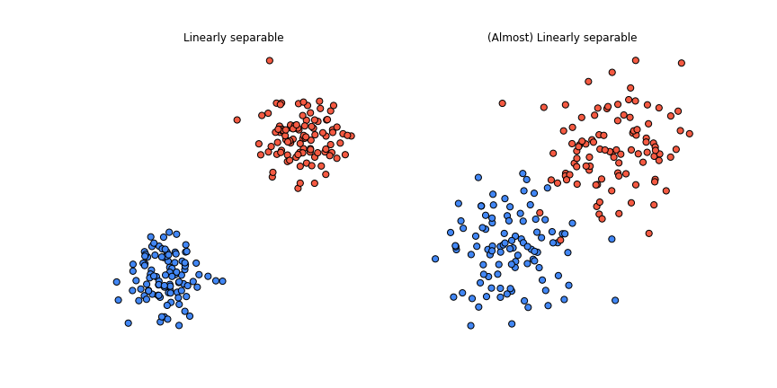
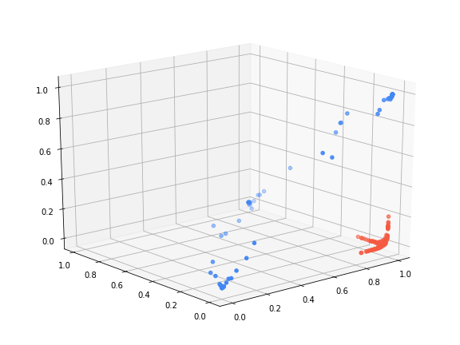
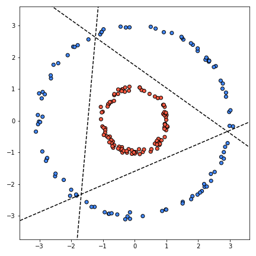

- *I'm assuming that the reader is familiar with linear classifiers*

- *For the entirety of this post I will be assuming binary classes but everything that I write here can be extended to multi-class problems*

There are many types of neural networks, each having some advantage over others, in this post I want to introduce the simplest form of a neural network, a Multi-Layer Perceptron (MLP). MLPs are a powerful method for approximating functions and it's a relatively simple model to implement.

Before we jump into talking about MLPs, let's quickly go over linear classifiers. Given training data as pairs $$(\boldsymbol{x}_i, y_i)$$ where $$\boldsymbol{x}_i \in \mathbb{R}^n$$ are our datapoints (observations) and $$y_i \in \{0, 1\}$$ are their corresponding class labels. The goal is to learn a vector of weights $$\boldsymbol{w}$$ and a bias $$b$$ such that $$\boldsymbol{w}^T\boldsymbol{x} + b \ge 0$$ if $$\boldsymbol{x}$$ belongs to the positive class and $$\boldsymbol{w}^T\boldsymbol{x} + b < 0$$ otherwise (belongs to negative class). This decision can be written as the following step function:

$$\text{Prediction} = \begin{cases}
      1 & \boldsymbol{w}^T\boldsymbol{x} + b \ge 0 \\
      0 &  \text{Otherwise}\\
\end{cases}$$

In the case of Logistic Regression the decision function is characterized by the sigmoid function $$\sigma(z) = \frac{1}{1+e^{-z}}$$ where $$z = \boldsymbol{w}^T\boldsymbol{x} + b$$

$$\text{Prediction} = \begin{cases}
      1 & \sigma(z) \ge \theta \\
      0 &  \text{Otherwise}\\
\end{cases}$$

Where $$\theta$$ is usually set to be 0.5.

*Note: These are actually just a couple of examples of a zoo of functions that people in deep learning literature refer to as Activation functions.*

If the dataset is linearly separable this is all fine, since we can always learn $$\boldsymbol{w}$$ and $$b$$ that separates the data perfectly. We're good even if the dataset is almost linearly separable, i.e the data points can be separated with a line, barring a few noisy observations.  

But what can we do if the dataset is highly non-linear? for example something like this:

One thing we could potentially do is to come up with some non-linear transformation function $$\phi(\boldsymbol{x})$$ such that the data becomes linearly separable. We can then apply that transformation to the original dataset and learn a linear classifier on the transformed dataset.

For example in this case we can see that the data points come from two co-centric circles. We can use this information to come up with a function: $$\phi(\boldsymbol{x}) = [x_1^2, x_2^2]$$

Now we can learn a vector $$\boldsymbol{w}$$ and bias $$b$$ such that $$\boldsymbol{w}^T\phi(\boldsymbol{x}) + b \ge 0$$ if $$\boldsymbol{x}$$ is positive and $$\boldsymbol{w}^T\phi(\boldsymbol{x}) + b < 0$$ otherwise.

This works, but what can we do when it's not obvious what the underlying function is? What if we're working in high dimensions where we can't visualize the shape of the dataset? In general it's hard to come up with these transformation functions.

Here's another idea, instead of learning one linear classifier let's try to learn three linear classifiers and then combine them to get something like this:

We know how to learn a single linear classifier but how can we learn three linear classifiers that can produce a result like this? The naive approach would be to try to learn them independently using different random initializations and hope that they converge to something like what we want. But this approach is doomed from the beginning since each classifier will try to fit the whole data while ignoring what the other classifiers are doing. In other words there will be no cooperation since none of the classifiers will be 'aware' of each other. This is the opposite of what we want. We want/need the classifiers to work together.

This is where MLPs come in. A two-layer MLP can actually do both of the aforementioned things. It can learn a non-linear transformation that makes the dataset linearly separable and it can learn multiple linear classifiers that cooperate.

**First Layer:**

Let's continue our idea of learning three classifiers: $$(\boldsymbol{w_1}, b_1), (\boldsymbol{w_2}, b_3)$$ and $$(\boldsymbol{w_3}, b_3)$$. For compactness, let's combine all of the classifiers into a single matrix and all of the biases into a vector.

$$\boldsymbol{W} = \begin{bmatrix}
           \boldsymbol{w_1} \\
           \boldsymbol{w_2} \\
           \boldsymbol{w_3} \\
         \end{bmatrix} = \begin{bmatrix}
                    w_1^{(1)} & w_1^{(2)}\\
                    w_2^{(1)} & w_2^{(2)}\\
                    w_3^{(1)} & w_3^{(2)}\\
                  \end{bmatrix} \boldsymbol{b} = \begin{bmatrix}
                             b_1 \\
                             b_2 \\
                             b_3 \\
                           \end{bmatrix}$$

<!-- Let's continue with our idea of learning three classifiers but instead of looking at them as independent classifiers, let's define them as units into a single layer. Each units 'job' will be to learn to classify some portion of the input space. This will be the first layer of our MLP.

We will also need a way to combine the outputs of each unit into a final classification decision. In order to do this we can define another classifier that will take as input the outputs of all of the units and will output a classification decision.

**First Layer:**

For simpler notation, let's combine $$\boldsymbol{w_1}, \boldsymbol{w_2}$$ and $$\boldsymbol{w_3}$$ into a matrix and call it $$\boldsymbol{W}$$ and combine $$b_1, b_2$$, and $$b_3$$ into a vector and call it $$\boldsymbol{b}$$.

$$\boldsymbol{W} = \begin{bmatrix}
           \boldsymbol{w_1} \\
           \boldsymbol{w_2} \\
           \boldsymbol{w_3} \\
         \end{bmatrix} = \begin{bmatrix}
                    w_1^{(1)} & w_1^{(2)}\\
                    w_2^{(1)} & w_2^{(2)}\\
                    w_3^{(1)} & w_3^{(2)}\\
                  \end{bmatrix} \boldsymbol{b} = \begin{bmatrix}
                             b_1 \\
                             b_2 \\
                             b_3 \\
                           \end{bmatrix}$$ -->

Now we need to get the classification decision from all three classifiers. We might be tempted to use the step function but for technical reasons that will become clear later on, we require the function to be differentiable and since the step function is not, we cannot use it. We could however use the sigmoid.

The classification decision from each of the units can then be obtained by applying $$\sigma$$ element-wise to each of the three outputs.

$$\sigma(\boldsymbol{Wx} + \boldsymbol{b}) = \begin{bmatrix}
\sigma(\boldsymbol{w_1x} + b_1) \\
\sigma(\boldsymbol{w_2x} + b_2) \\
\sigma(\boldsymbol{w_3x} + b_3) \\
\end{bmatrix}$$

In the neural network lingo this is a hidden layer with 3 sigmoid units. But we need not use sigmoid here. As I mentioned in the beginning of this post, the sigmoid function is just one example of many activation functions. We could use anything we want (as long as it's differentiable). Here are a few alternatives: Tanh, ReLu, LeakyReLu etc. The most popular choice in practice is the ReLu activation defined as $$\max(0, x)$$

**Second Layer:**

The first layer gives us three outputs but we still need a way to combine them into a final classification decision. For example if the outputs from the layer is $$[0.7, 0.6, 0.2]$$ what should the classification decision be?

Let's define another classifier $$(\boldsymbol{w}_{final}, b_{final})$$ that will take the outputs of the three classifiers as input and will produce a final output: $$\boldsymbol{w}_{final}^T\sigma(\boldsymbol{Wx} + \boldsymbol{b}) + b_{final}$$

And finally in order to get the final classification decision, we apply a sigmoid activation to the result of this as well. Combining all the parts we get that our function is defined as:

 $$\text{MLP}(x) =\sigma(\boldsymbol{w}_{final}^T\sigma(\boldsymbol{Wx} + \boldsymbol{b}) + b_{final})$$

This one line actually fully defines our two-layer MLP.

All is left is to define a loss function over the above function and optimize it with respect to $$\boldsymbol{W}, \boldsymbol{b}, \boldsymbol{w}_{final}, b_{final}$$ using backpropagation. Which I will be talking about in the next post (hopefully).

**Result:**

I want to skip ahead a little bit and show what the result will be after learning the parameters. Going back to how we started, we said that if we had a transformation function that could make the dataset linearly separable then learning would be easy. Well $$\phi(\boldsymbol{x}) = \sigma(\boldsymbol{Wx} + \boldsymbol{b})$$ will actually be that transformation that makes the dataset linearly separable. This is what the data looks like after applying that learned function:

And these are the three linear classifiers that are learned in the hidden layer:

pretty neat huh?
